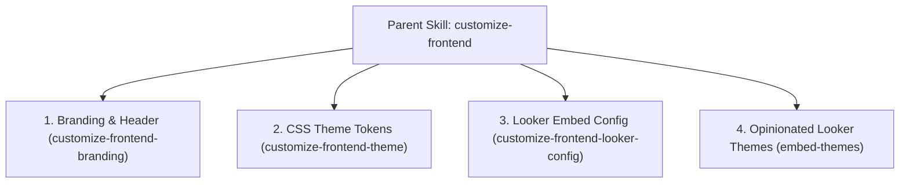

# Looker Embed Portal - Master Frontend Customization Workflow

This parent skill orchestrates the end-to-end customization of the frontend portal. When a user requests to customize the UI, logo, theme colors, or Looker embed configuration, execute the appropriate sub-skills below in sequence.

---

## Workflow Overview

### Step 1: Branding & Header (`customize-frontend-branding`)
Modify application titles, root navbar labels, route breadcrumbs, and replace the SVG or image logo.
- **Key files**: `Sidebar.tsx`, `Navbar.tsx`, `LookerLogo.tsx`, `constants.ts` (`ROUTE_BREADCRUMB_MAPPINGS`).

### Step 2: CSS Theme Tokens (`customize-frontend-theme`)
Modify frontend design system tokens (primary/accent HSL colors, Google Fonts, spacing, border radii, shadows).
- **Key file**: `styles.css`.

### Step 3: Looker Embed Config (`customize-frontend-looker-config`)
Update Looker instance endpoints, default dashboard IDs, explore paths, conversational analytics agent IDs, and role permissions (`ROLE_PERMISSIONS`).
- **Key files**: `.env`, `constants.ts`.
- **Remember**: Use Looker MCP tools (`mcp_looker_get_dashboards`, `mcp_looker_get_explores`, `mcp_looker_get_models`) to discover valid IDs before updating targets.

### Step 4: Opinionated Looker Brand Themes (`embed-themes`)
Ensure Looker instance themes follow the opinionated brand setup pattern with sanitization (spaces converted to underscores, non-alphanumeric removed):
- For each brand listed in `BRAND_OPTIONS` (e.g. `Levi's`, `Calvin Klein`, `Allegra K`), create/manage corresponding sanitized themes in Looker:
  - `<clean_brand>_Light` (e.g. `Levis_Light`, `Calvin_Klein_Light`, `Allegra_K_Light`)
  - `<clean_brand>_Dark` (e.g. `Levis_Dark`, `Calvin_Klein_Dark`, `Allegra_K_Dark`)
- The frontend dynamically loads `${clean_brand}_Light` or `${clean_brand}_Dark` based on the user's selected brand and active color scheme, falling back to `VITE_THEME` if not defined.

---

## Verification
After executing any frontend customization step:
1. Verify TypeScript types and JSX validity.
2. Run `pnpm run build` inside `frontend/` to confirm zero build errors.
