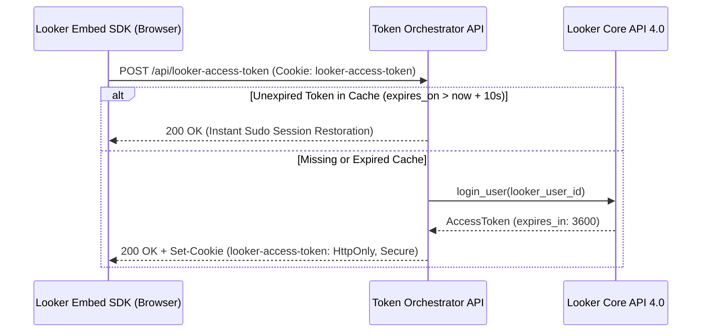

# Looker Embed Demo APIs (`demo-apis`)

This skill defines the core architecture, security standards, and session orchestration patterns for embedding Looker LookML Explores and Dashboards using the Looker Embed SDK and Looker Core API 4.0.

## Core Security & Orchestration Pillars

1. **Zero-Trust Visitor Identity (`looker-external-user-id`)**:
   Automatically track and assign an unguessable 12-character alphanumeric external identifier (`a-zA-Z0-9`) to every visitor iframe session without requiring Looker instance user pre-registration.
2. **Looker API Token Bloat Reduction (`POST /api/looker-access-token`)**:
   Eliminate repetitive login round-trips (`login_user`) to Looker's internal authentication servers. Enforces local client-side cookie caching with an absolute UTC Time-To-Live (TTL) buffer.
3. **Stateful Session Obfuscation & Encryption (`POST /api/looker-cookieless/<type>`)**:
   Deliver public authorization and navigation tokens to the client-side Looker Embed SDK while encrypting and trapping the sensitive `session_reference_token` inside an `HttpOnly`, `Secure` cookie.
4. **Strict Role-Based Access Control (RBAC)**:
   Never accept raw permission strings from client browsers. Strictly map client role identifiers (`viewer` vs `explorer`) to curated LookML Explore and Dashboard entitlements.

---

## 1. Zero-Trust Looker Embed Provisioning

To maintain persistent user attributes and workspace isolation across embedded Looker Explore iframes, all API interactions operate behind a unified identity layer.

### Specification
* **Identifier Generation**: Generates cryptographically secure 12-character alphanumeric identifiers (`a-zA-Z0-9`) via `random.SystemRandom()`.
* **Looker Association**: Associates the external identifier with an internal Looker `embed` credential upon first session acquisition.
* **Cookie Persistence**: Binds the visitor ID to a long-term 5-year duration (`max_age=157680000`) cookie (`looker-external-user-id`) across secure HTTPS transport.

---

## 2. API Access Token Caching & Sudo Sudoing (`POST /api/looker-access-token`)

Calling Looker's `login_user` repeatedly introduces API throttling and pollutes Looker's internal token database. This endpoint leverages local cookie caching to instantly restore active sudo sessions.

### Execution Flow

* **Proactive TTL Buffer**: Enforces an absolute UTC expiration timestamp (`now + expires_in`) with a **10-second safety margin** to prevent Looker SDK requests from failing mid-flight.
* **Automatic Credential Resolution**: Resolves the internal integer Looker User ID (`looker_user_id`) from active cookieless embed authentication JWT payloads or via `user_for_credential`.

---

## 3. Cookieless Embed Orchestration (`POST /api/looker-cookieless/<type>`)

Orchestrates the two-part handshake required by the Looker Embed SDK (`acquire_embed_cookieless_session` and `generate_tokens_for_cookieless_session`).

### A. Session Acquisition (`type = "acquire"`)
* **Role-Based RBAC Overrides**: Accepts a role mapping (`role: "viewer"` or `role: "explorer"`). Strictly maps roles to curated Looker permissions:
  * `viewer`: `["access_data", "see_looks", "see_user_dashboards", "see_lookml_dashboards"]`
  * `explorer`: Adds `["save_content", "explore", "embed_browse_spaces"]`.
* **Session Resumption**: Inspects the `looker-embed-tokens` cookie. If an encrypted `session_reference_token` exists, decrypts it and attempts session resumption on Looker Core API 4.0. If resumption fails, automatically retries to acquire a fresh session.
* **Stateful Obfuscation Split (CRITICAL SECURITY)**:
  * **Encrypts** `session_reference_token` using an HMAC-SHA256 CTR-mode stream cipher (`ENCRYPTION_KEY`) and stores it inside the stateful `HttpOnly`, `Secure` cookie (`looker-embed-tokens`).
  * **Delivers** only the non-sensitive `authentication_token`, `navigation_token`, and `api_token` to the client browser.

### B. Token Generation & TTL Refresh (`type = "generate"`)
* **Purpose**: Called periodically by the browser SDK (`session:tokens:request` events) to extend active navigation and API token TTLs.
* **Flow**:
  1. Retrieves and decrypts `session_reference_token` from the `looker-embed-tokens` cookie.
  2. Submits the refresh payload to Looker API 4.0 bound to the verified visitor `User-Agent`.
  3. Re-encrypts the returned reference token and updates the `looker-embed-tokens` cookie.
  4. Delivers refreshed `api_token` and `navigation_token` schemas to the browser iframe.
* **Dual-Session Sync**: Automatically refreshes any accompanying Looker Core API access token (`looker-access-token`) in tandem to keep client and API states perfectly synchronized.
