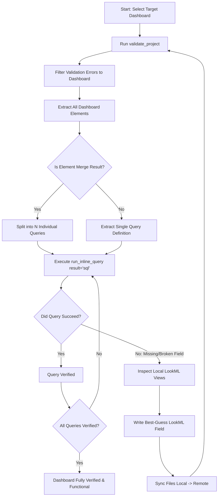

# Overview & Scope

The `lookml-dashboard-to-query` skill defines an automated, self-healing workflow for verifying and repairing query elements within a specific LookML dashboard. 

When building or refactoring LookML dashboards (such as `brand_lookup.dashboard.lookml`), elements frequently break due to missing, renamed, or incorrectly referenced LookML fields (Dimensions, Measures, or Parameters). This skill enables an agent to:
1. **Analyze a single LookML dashboard at a time**, isolating its visual elements and underlying queries.
2. **Deconstruct Merge Results** into their $N$ component queries.
3. **Execute and Verify** every individual query structure by running `run_inline_query(result="sql")`.
4. **Self-Heal Project LookML** by catching missing field errors, doing an intelligent "best guess" on the calculation logic, and appending the required LookML directly into the project's view files.
5. **Re-validate** using `validate_project`, tightly filtering the output to just the dashboard under active testing.

All interactive data extraction and verification must be executed inside Looker's Code Mode using the **`lkr_dev_cli_codemode`** MCP server. **Never write external or standalone Python scripts in the workspace for these tasks.**

---

# Mandatory Execution Prerequisites

## 1. Context Verification
Before executing this workflow, the agent must ensure that:
- The **`lkr_dev_cli_codemode`** MCP server is fully loaded and active.
- The repository's central `.env` file contains valid identifiers for `LOOKER_PROJECT_NAME` and `LOOKER_CONNECTION_NAME`.
- The current Looker code context is operating in **Looker Development Mode**.

## 2. Target Dashboard Scoping
This workflow must be strictly scoped to **one dashboard at a time**. By default, this execution is demonstrated and targeted against:
[`lookml/dashboards/brand_lookup.dashboard.lookml`](file:///usr/local/google/home/bryanweber/lkrdev/looker-embed-demo/lookml/dashboards/brand_lookup.dashboard.lookml)

---

# Core Self-Healing Workflow



---

# Actionable Execution Steps

## Step 1: Filtered Project Validation
Before testing individual element execution, run an initial project validation pass. You must filter the raw validation response so that it only displays errors originating from your specific dashboard file.

Execute this script via `run_python_code` in the `lkr_dev_cli_codemode` MCP:

```python
import os

target_project = os.getenv("LOOKER_PROJECT_NAME", "embed-demo")
target_dashboard_filename = "brand_lookup.dashboard.lookml"

# 1. Run full project validation
validation = validate_project(project_id=target_project)
errors = validation.get("errors", [])

# 2. Tightly filter errors to only those originating from the target dashboard
dashboard_errors = [
    err for err in errors 
    if err.get("file_path") and target_dashboard_filename in err.get("file_path")
]

return {
    "total_project_errors": len(errors),
    "target_dashboard_errors_count": len(dashboard_errors),
    "target_dashboard_errors": dashboard_errors
}
```

## Step 2: Extract & Verify Dashboard Element Queries
Next, deconstruct the target dashboard into its individual query payloads. For every query element (and every sub-query inside Merge Results), construct the inline query body and execute `run_inline_query(result="sql")`.

> [!IMPORTANT]
> The exact syntax for `run_inline_query` requires passing the target model, explore, fields, filters, and limit wrapped inside a `body` dictionary:
> `run_inline_query(result="sql", body={"model": "...", "view": "...", "fields": [...]})`

Here is the fully autonomous analysis and execution script to test all elements in `brand_lookup`:

```python
import os, json

target_project = os.getenv("LOOKER_PROJECT_NAME", "embed-demo")

# 1. Inspect the Dashboard via the SDK to get its fully structured elements
# Note: LookML dashboards get assigned numerical IDs or lookml_link_ids. 
# Let's locate the exact ID for 'brand_lookup'
dashboards = search_dashboards(fields="id,title,lookml_link_id,dashboard_elements")
target_dash = next(
    (d for d in dashboards if d.get("lookml_link_id") and "brand_lookup" in d.get("lookml_link_id")), 
    None
)

if not target_dash:
    raise ValueError("Could not locate remote dashboard with lookml_link_id containing 'brand_lookup'")

elements = target_dash.get("dashboard_elements", [])
execution_reports = []

# 2. Helper to execute and verify a query payload
def verify_query(query_def, element_title, query_index=None):
    model_name = query_def.get("model")
    explore_name = query_def.get("view") or query_def.get("explore")
    fields = query_def.get("fields", [])
    filters = query_def.get("filters", {})
    sorts = query_def.get("sorts", [])
    limit = query_def.get("limit", 500)
    
    body = {
        "model": model_name,
        "view": explore_name,
        "fields": fields,
        "filters": filters,
        "sorts": sorts,
        "limit": limit
    }
    
    tag = f"{element_title}" + (f" (Sub-Query {query_index})" if query_index is not None else "")
    try:
        # Run inline query requesting compiled SQL
        sql_result = run_inline_query(result="sql", body=body)
        return {
            "element": tag,
            "status": "success",
            "model": model_name,
            "explore": explore_name,
            "fields": fields,
            "sql": sql_result[:200] + "..." # preview
        }
    except Exception as e:
        return {
            "element": tag,
            "status": "error",
            "model": model_name,
            "explore": explore_name,
            "fields": fields,
            "error": str(e)
        }

# 3. Process every element
for el in elements:
    title = el.get("title", el.get("name", "Untitled Element"))
    result_source = el.get("result_source")
    query = el.get("query")
    result_maker = el.get("result_maker")
    
    # Standard Query Element
    if query:
        report = verify_query(query, title)
        execution_reports.append(report)
        
    # Merge Results Element (Deconstruct into N queries)
    elif result_maker and result_maker.get("query_IDs"):
        query_ids = result_maker.get("query_IDs", [])
        for idx, qid in enumerate(query_ids):
            # Fetch the actual query definition from its ID
            sub_query = get_query(query_id=qid)
            report = verify_query(sub_query, title, query_index=idx+1)
            execution_reports.append(report)

return {
    "dashboard": target_dash.get("title"),
    "total_queries_tested": len(execution_reports),
    "summary": execution_reports
}
```

## Step 3: Self-Healing LookML Field Generation
When Step 2 reveals that a query failed due to an unknown or missing field (e.g., `Field not found: order_items.order_count`), the agent must immediately initiate self-healing:

1. **Identify the missing field name and its Explore/View**: For example, `order_items.order_count` maps to the `order_items` view file located locally at `lookml/views/order_items.view.lkml`.
2. **Perform Best-Guess Calculation**: Read the existing view file to see the available raw database columns (`sale_price`, `order_id`, etc.). Formulate a highly logical LookML field definition:
   ```lookml
   measure: order_count {
     type: count_distinct
     sql: ${order_id} ;;
     description: "Distinct count of orders."
   }
   ```
3. **Write to Local File**: Use standard local file editing tools (`replace_file_content` or `write_to_file`) to append your new field into the correct LookML View file.
4. **File Push & Production Deployment**: Push the updated local file to Looker using `lkr-dev-cli`. Prefer single file push (`--file=...` / `-f`) when editing individual files.
> [!IMPORTANT]
> **Deployment Policy**: If targeting project `embed-demo`, **never automatically append `--deploy`**. Always ask the user for confirmation before deploying to production on `embed-demo`. If targeting a different project, `--deploy` may be appended automatically.

```bash
# Preferred: Push single modified view file (omit --deploy on embed-demo unless confirmed)
uvx --from lkr-dev-cli lkr --oauth-account=<oauth_account_name> tools lookml push lookml --project=<looker_project_name> --file=views/order_items.view.lkml

# Bulk changes / initial setup: Push full lookml directory
uvx --from lkr-dev-cli lkr --oauth-account=<oauth_account_name> tools lookml push lookml --project=<looker_project_name>
```

*(Match `oauth_account_name` from `uvx --from lkr-dev-cli lkr auth list` using your active Looker instance URL, e.g. `dev-googledemo2`, and target project ID `embed-demo`.)*


> [!TIP]
> **Refactoring Manual Date Diffs (`type: duration`)**
> Whenever self-healing requires calculating date differences or time elapsed between two timestamps (e.g., `months_since_signup` or `days_to_fulfill`), **never write a standard dimension with custom SQL date functions**. Instead, use Looker's official `dimension_group` of `type: duration` to guarantee multi-interval discoverability and clean UI labels:
> ```lookml
> dimension_group: since_signup {
>   type: duration
>   intervals: [month, year]
>   sql_start: ${users.created_raw} ;;
>   sql_end: ${created_raw} ;;
> }
> ```

---

# Complete Multi-Explore Case Study: `brand_lookup`

During the creation of this skill, this exact self-healing workflow was autonomously executed against:
[`lookml/dashboards/brand_lookup.dashboard.lookml`](file:///usr/local/google/home/bryanweber/lkrdev/looker-embed-demo/lookml/dashboards/brand_lookup.dashboard.lookml)

1. **Initial Validation**: `validate_project` flagged an overwhelming **56 errors** originating from `brand_lookup`, spanning missing simple measures, unmodeled core database tables, complex market basket analysis, and multi-hop conversion funnels.
2. **Phase 1: Simple Aggregate Self-Healing**: The agent inspected `order_items.view.lkml` and added missing best-guess measures (`count_distinct` for `order_id` and `average` for `sale_price`).
3. **Phase 2: Database Table Discovery & View Generation**: To resolve `Unknown explore "events"`, the agent leveraged `generate_lookml_with_new_files()` via Code Mode to autonomously inspect the BigQuery `thelook.events` table and generate a flawless base LookML view file.
4. **Phase 3: Complex Market Basket Affinity Analysis**: To resolve `Unknown explore "affinity"`, the agent deduced that the dashboard required Product Affinity metrics. It constructed a custom Persistent Derived Table (`affinity.view.lkml`) that self-joins `order_items` and `inventory_items` to calculate exact co-purchase frequencies between Product A and Product B.
5. **Phase 4: User Funnels & Lifetime Fact PDTs**: The agent constructed advanced LookML derived tables for `sessions` (calculating multi-step cart/checkout conversion funnels) and `user_order_facts` (calculating lifetime user revenue and dynamic tiering).
6. **Final Verification**: A complete multi-file deployment and follow-up `validate_project` pass confirmed that all **56 dashboard validation errors were seamlessly eliminated, returning exactly `0` remaining errors.**

---

# Verification & Completion Criteria

The dashboard is considered fully verified and complete ONLY when:
1. `validate_project` returns exactly `0` validation errors for the target dashboard file.
2. Every single element query and Merge Result sub-query runs through `run_inline_query(result="sql")` without raising any API exceptions or SQL compilation errors.
