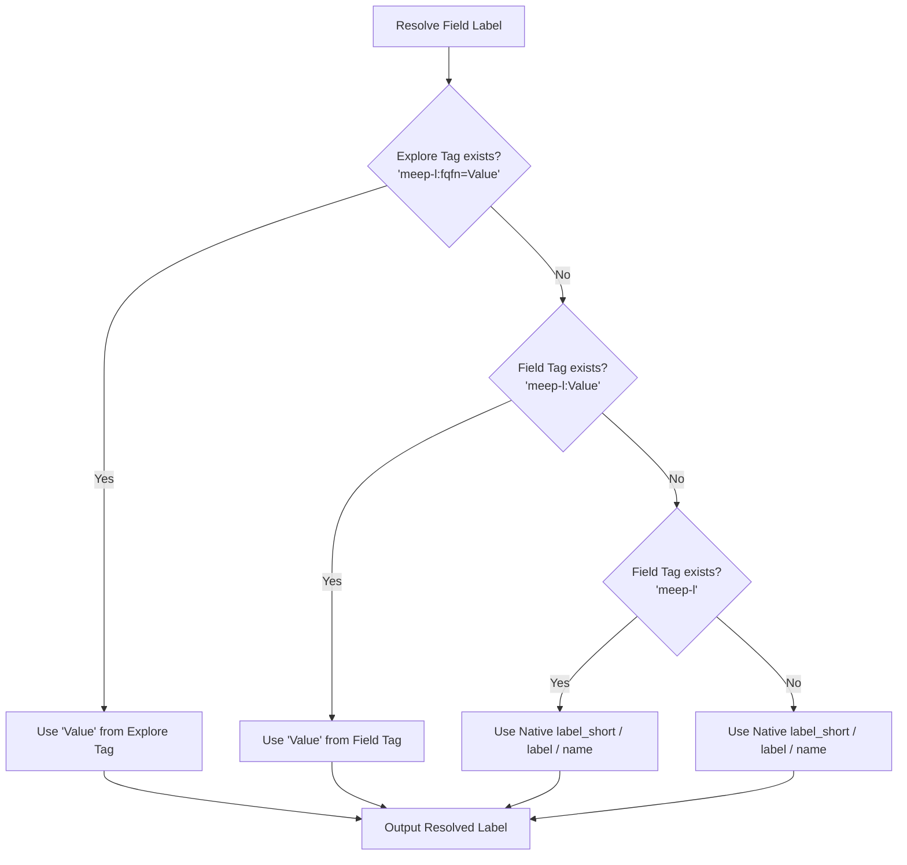
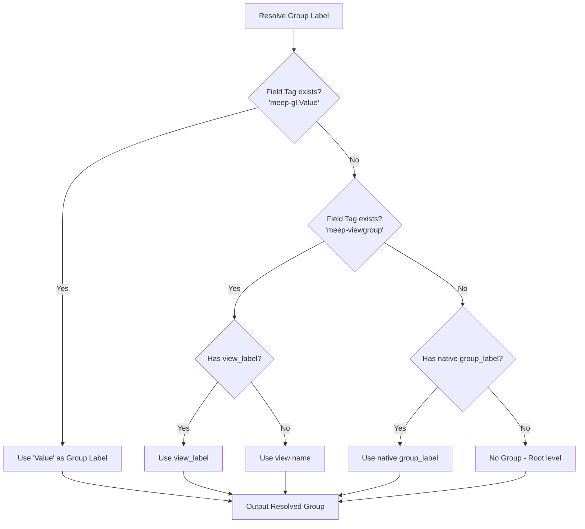

# Instructions

## 1. Overview of Multi-Explore Experience Pattern (MEEP)

The Multi-Explore Experience Pattern (MEEP) is a standardized convention for using LookML `tags` to control how fields and Explores are unified, relabeled, grouped, and linked in a multi-explore reporting interface (such as a multi-explore query builder or report builder). 

By embedding these specific `meep-*` instructions within the LookML `tags` parameter, developers can customize the end-user reporting experience without altering the core semantic meaning, default UI labels, or standard behavior of the underlying LookML model.

### Core Architecture & Visibility Rules
*   **Default Visibility**: Explores, views, dimensions, and measures that are marked as `hidden: yes` in LookML are **excluded by default** from the MEEP interface.
*   **Mandatory Timeline Linking**: **CRITICAL REQUIREMENT**: Every measure that is not explicitly excluded (via `meep-x`) **MUST** include a `meep-ldt` tag to link it to a standardized timestamp. This guarantees that metrics from disparate Explores can always be plotted together along a unified timeline.
*   **Fully Qualified Field Names (FQFN)**: To accurately track and query unified fields that exist across multiple Explores, MEEP defines a Fully Qualified Field Name (FQFN) structured as `model_name.explore_name.view_name.field_name` (e.g., in TypeScript: `explore.id.split('::').join('.') + '.' + field.name`).

## 2. Field-Level MEEP Tags

These tags are applied to individual `dimension`, `measure`, or `dimension_group` fields inside a LookML view.

### `meep-gl:<Group Label>`
*   **Purpose**: Rewrites the field's `group_label` specifically for the MEEP interface.
*   **Behavior**: Groups fields under this new label when stacked or displayed in a multi-explore experience, overriding the default LookML `group_label` or view name.
*   **Example**:
    ```lookml
    dimension: user_status {
      type: string
      sql: ${TABLE}.status ;;
      tags: ["meep-gl:User Demographics"]
    }
    ```

### `meep-viewgroup`
*   **Purpose**: Automatically groups fields using their underlying `view_label` specifically for the MEEP interface.
*   **Behavior**: When applied to a field, the engine takes the field's `view_label` (or view name) and applies it as the field's `group_label`. This resolves ambiguous label rollups (such as two different views contributing a "City" dimension to the same Explore) by nesting them in separate view-level folders.
*   **Example**:
    ```lookml
    dimension: city {
      type: string
      sql: ${TABLE}.city_name ;;
      view_label: "Distribution Centers"
      tags: ["meep-viewgroup"]
    }
    ```

### `meep-l:<Label>`
*   **Purpose**: Rewrites the field's `label` specifically for the MEEP interface.
*   **Behavior**: Displays the field with this customized label in the MEEP interface, overriding the default LookML `label` or field name. This is useful for creating concise or highly standardized names when fields from multiple explores are merged.
*   **Example**:
    ```lookml
    dimension: id {
      type: number
      sql: ${TABLE}.id ;;
      tags: ["meep-l:User ID"]
    }
    ```

### `meep-d:<Description>`
*   **Purpose**: Rewrites the field's `description` specifically for the MEEP interface, and designates the winning description when fields across Explores are layered together.
*   **Behavior**: Displays the field with this customized description in the MEEP interface. When layering dimensions together (such as Brand or Category) across multiple Explores, if descriptions differ, any field marked with `meep-d:<Description>` (or tagged `meep-d` to designate its native description) will serve as the winning description. If no field is marked with `meep-d`, the description from the last processed Explore wins.
*   **Example**:
    ```lookml
    dimension: brand {
      type: string
      sql: ${TABLE}.brand_name ;;
      tags: ["meep-d:Premium Brand Title"]
    }
    ```

### `meep-ldt:<view_name>.<field_name>`
*   **Purpose**: Links a measure to a specific timestamp/date dimension.
*   **Scope**: **Measures only. MANDATORY FOR ALL NON-EXCLUDED MEASURES.**
*   **Behavior**: Establishes a formal relationship between an aggregated metric and a specific time dimension (fully qualified as `view_name.field_name`). This is critical for multi-explore experiences that need to plot metrics from entirely different Explores or models along a single shared timeline.
*   **Example**:
    ```lookml
    measure: total_sales {
      type: sum
      sql: ${sale_price} ;;
      tags: ["meep-ldt:orders.created_date"]
    }
    ```

### `meep-dtx:<timeframe>`
*   **Purpose**: Excludes a specific timeframe from a time dimension/dimension group to ensure parity across layered dates.
*   **Scope**: **Time dimensions / Dimension Groups.**
*   **Behavior**: When layered "Dates" from multiple Explores are merged into a single UI axis, they must contain the exact same set of available timeframes. If one date dimension contains an extra timeframe (e.g., `month_name`) that others lack, the `meep-dtx:month_name` tag explicitly suppresses it to maintain exact parity and ensure automated validation tests pass.
*   **Example**:
    ```lookml
    dimension_group: created {
      type: time
      timeframes: [date, month, month_name]
      tags: ["meep-dtx:month_name"] 
    }
    ```

### `meep-ddt`
*   **Purpose**: Marks a default date dimension group of type `time` in a view.
*   **Scope**: **Dimension Groups of type `time`.**
*   **Behavior**: When applied, all measures defined in the same view that do not declare an explicit timeline link (via `meep-ldt`) will automatically default to this date. This reduces LookML verbosity by avoiding the need to tag every single measure in the view.
*   **Example**:
    ```lookml
    dimension_group: created {
      type: time
      timeframes: [date, month, year]
      tags: ["meep-ddt"]
    }
    ```

### `meep-bdt`
*   **Purpose**: Marks a base date timeline group specifically for explore selection tie-breaking.
*   **Scope**: **Dimension Groups of type `time`.**
*   **Behavior**: When multiple explores match a query where only date is selected (e.g. `__date.year`), the MEEP engine will break the tie by preferring the explore whose timeline has been explicitly designated as the base date timeline using `meep-bdt`.
*   **Example**:
    ```lookml
    dimension_group: created {
      type: time
      timeframes: [date, month, year]
      tags: ["meep-bdt"]
    }
    ```

### `meep-i` (Field Level)
*   **Purpose**: Overrides default LookML hiding to force-include a field in the MEEP interface.
*   **Behavior**: If a field is configured with `hidden: yes` in LookML, adding the `meep-i` tag forces the MEEP interface to surface it regardless.
*   **Example**:
    ```lookml
    dimension: internal_id {
      type: number
      hidden: yes
      sql: ${TABLE}.id ;;
      tags: ["meep-i", "meep-l:Internal Ref ID"]
    }
    ```

### `meep-x` (Field Level)
*   **Purpose**: Excludes the field from the MEEP interface entirely.
*   **Behavior**: When a field contains this tag, it will be completely stripped out and ignored by the MEEP field/metric selectors.
*   **Example**:
    ```lookml
    dimension: internal_tracking_code {
      type: string
      sql: ${TABLE}.tracking_code ;;
      tags: ["meep-x"]
    }
    ```

## 3. Explore-Level MEEP Tags

These tags are applied at the Explore definition level in a model file (`explore: explore_name { ... }`).

### `meep-i` (Explore Level)
*   **Purpose**: Overrides default LookML hiding to force-include an entire Explore.
*   **Behavior**: If an Explore is configured with `hidden: yes` in the model, adding the `meep-i` tag forces the MEEP interface to load and process it.
*   **Example**:
    ```lookml
    explore: secret_beta_explore {
      hidden: yes
      tags: ["meep-i"]
    }
    ```

### `meep-i:<view_name>`
*   **Purpose**: Overrides default LookML hiding to force-include a specific view/join within an Explore.
*   **Behavior**: If a joined view has `fields: []` or is otherwise hidden, `meep-i:view_name` forces the MEEP interface to process and include that view's fields.
*   **Example**:
    ```lookml
    explore: e_commerce {
      tags: ["meep-i:historical_orders"]
      join: historical_orders {
        type: left_outer
        sql_on: ${e_commerce.id} = ${historical_orders.user_id} ;;
        relationship: one_to_many
      }
    }
    ```

### `meep-x` (Explore Level)
*   **Purpose**: Excludes the entire Explore from the MEEP interface.
*   **Behavior**: If an Explore has this tag, none of its views, dimensions, or measures will be loaded or processed by the multi-explore experience.
*   **Example**:
    ```lookml
    explore: deprecated_explore {
      tags: ["meep-x"]
    }
    ```

### `meep-x:<view_name>`
*   **Purpose**: Excludes all fields from a specific view within an Explore.
*   **Behavior**: When applied to an Explore definition, any field whose fully qualified name starts with `view_name.` will be completely excluded from the MEEP interface for that specific Explore. This is exceptionally useful for excluding complex join tables or utility views from self-serve reporting interfaces.
*   **Example**:
    ```lookml
    explore: e_commerce {
      tags: ["meep-x:internal_audit_log"]
      join: internal_audit_log {
        type: left_outer
        sql_on: ${e_commerce.id} = ${internal_audit_log.query_id} ;;
        relationship: one_to_many
      }
    }
    ```
    *(In this example, all fields within the `internal_audit_log` view, such as `internal_audit_log.created_time` or `internal_audit_log.action`, are excluded from the `e_commerce` Explore's MEEP interface).*

### `meep-l:<field_name>=<Label>` (Explore Level)
*   **Purpose**: Rewrites the UI label of a specific field (dimension or measure) specifically for that Explore.
*   **Behavior**: When applied to an Explore definition, any field whose name matches `<field_name>` (e.g., `users.count`) will be displayed with `<Label>` in the MEEP interface for that specific Explore.
*   **Example**:
    ```lookml
    explore: order_items {
      tags: ["meep-l:users.count=Purchasing Users"]
      join: users { ... }
    }
    ```

### Best Practice: Looker Refinements for MEEP Tags
To keep MEEP-specific presentation and UI configurations (such as custom labeling or exclusions) separate from the core, semantic database definitions, it is highly recommended to isolate MEEP tags in LookML refinements.

*   **File Location**: Create a refinement file at `path/to/explore/definition/refinements/meep.lkml`.
*   **Syntax**: Use `+` prefix on explores and views to apply MEEP tags cleanly.
*   **Example**:
    ```lookml
    # File: /models/refinements/meep.lkml
    explore: +order_items {
      tags: [
        "meep-x:inventory_items",
        "meep-x:user_order_facts",
        "meep-l:users.count=Purchasing Users"
      ]
    }
    ```
*   **Include in Model**: Make sure to include the refinements file at the top of your model files:
    ```lookml
    # File: /models/embed_demo2.model.lkml
    include: "path/to/explore/definition/refinements/meep.lkml"
    ```

*   **Documenting Expected UI Path and Labels**: When writing refinements and relabeling dimensions, always add a comment specifying the expected resolved MEEP UI Path (folder + label) for each active dimension.
    *   **Scope**: Only apply to dimensions that are actively refined and included in MEEP (do not add to measures or excluded fields).
    *   **Format**: Use `# <Folder Name> > <Field Label>` if the field is grouped, or `# <Field Label>` if the field is placed at the root level (no folder).
    *   **Field Label Derivation**: Note that if no explicit `meep-l` label override is provided, Looker automatically converts snake_case dimension names to Title Case (e.g., `sale_price` becomes `Sale Price`). Use this Title Case representation as the expected `<Field Label>` in the comment.
    *   **Line Placement**:
        *   If the dimension is defined on a single line, append the comment at the end of the line.
        *   If the dimension spans multiple lines, append the comment at the end of the `tags:` line.
    *   **Example**:
        ```lookml
        view: +users {
          # Single-line dimension refinement:
          dimension: city { tags: ["meep-gl:Demographics"] } # Demographics > City
          dimension: name { tags: ["meep-l:User Full Name"] } # User Full Name

          # Multi-line dimension refinement:
          dimension: category {
            label: "Product Category"
            tags: ["meep-gl:Product Hierarchy"] # Product Hierarchy > Category
          }
        }
        ```


## 3.5 MEEP Tag Resolution & Inheritance Hierarchies

When generating fields for the self-serve UI, the MEEP engine evaluates tag overrides and native LookML settings in a strict priority hierarchy. Context-specific/explicit overrides always take precedence over generic/implicit settings.

### Regular Label Resolution Hierarchy

The table below defines the order of evaluation for a field's display label in the MEEP UI (from highest priority/most specific to lowest priority/most generic):

| Priority | Level | Configuration | Output Label | Description |
| :--- | :--- | :--- | :--- | :--- |
| **1** | Explore Tag | `"meep-l:<fqfn>=<Value>"` (in Explore `tags`) | `<Value>` | Explicit override scoped specifically to this Explore. |
| **2** | Field Tag (Explicit) | `"meep-l:<Value>"` (in Field `tags`) | `<Value>` | Explicit override defined directly on the field. |
| **3** | Field Tag (Fallback) | `"meep-l"` (in Field `tags`) | Native Label / name | Direct instruction to surface the field with its native Looker labels. |
| **4** | Native label_short | `label_short` (LookML) | `label_short` | Looker-derived short label. |
| **5** | Native label | `label` (LookML) | `label` | Native Looker field label. |
| **6** | Native name | `name` (LookML) | `name` | Native Looker field name. |



### Group Label Resolution Hierarchy

The MEEP engine groups dimensions into folders according to the following priority hierarchy (from highest to lowest):

| Priority | Level | Configuration | Group Label | Description |
| :--- | :--- | :--- | :--- | :--- |
| **1** | Field Group Tag | `"meep-gl:<Value>"` (in Field `tags`) | `<Value>` | Explicit group label override. |
| **2** | Field Viewgroup Tag | `"meep-viewgroup"` (in Field `tags`) | `view_label` or `view` | Direct instruction to group the field under its view name or view label. |
| **3** | Native Group | `group_label` (LookML) | `field_group_label` | Native Looker group label. |
| **4** | Standalone | None | None | Field is placed at the root level (no group folder). |




## 4. Execution & UI Processing Logic (Use Cases)

To achieve a true "self-serve" unified multi-explore reporting interface without confusing the user with redundant underlying schema complexities, the MEEP processing engine must apply specific runtime transformation rules.

### Use Case: Unified Date/Timeline Presentation
In a multi-explore dataset, multiple Explores may have their own distinct timestamp columns (e.g., `orders.created_date`, `returns.returned_date`, `signups.signup_date`). When an end user builds a report with `Total Sale Price` and `Return Count` by "Date", they should not have to manually reconcile which date column belongs to which metric.

The MEEP processing engine resolves this through the following automated workflow:

1. **Automatic Date Exclusion (Pruning)**:
   - All `dimension_group` fields (of `type: time`) and standalone date/time dimensions are **automatically excluded/ignored** by default in the MEEP UI.
   - A date dimension is **only** surfaced if it is explicitly targeted by at least one included measure via `meep-ldt:<view>.<field>`.

2. **Standardized UI Labeling & Grouping**:
   - Any targeted time dimension surfaced in the MEEP UI is automatically assigned the Group Label **`"Dates"`** (or `"Time"`).
   - Its timeframes (`date`, `month`, `quarter`, `year`, `week`, `day_of_week`, etc.) are nested cleanly under concise, unified UI labels (e.g., "Month", "Quarter", "Year") rather than source-prefixed names.

3. **Query Engine Routing**:
   - When a user selects a timeframe (e.g., "Month") from the unified `"Dates"` group alongside measures from different Explores (e.g., `Total Sale Price` and `Return Count`), the engine maps the single UI "Month" selection back to the respective `meep-ldt` target for each measure (grouping `Total Sale Price` by `orders.created_month` and `Return Count` by `returns.returned_month`).

### Use Case: Layered Dimension Description Conflict Resolution
When layering shared dimensions (such as `Brand` or `Category`) across multiple Explores into a unified field selector, the underlying Explores might have conflicting descriptions for the same dimension. 

The MEEP processing engine resolves which description to surface through a predictable deterministic rule:
1. **Explicit Designated Winner**: If any of the layered candidate fields possesses a `meep-d:<Description>` tag (or the standalone `meep-d` tag), its description is permanently locked in as the winning description for that layered dimension.
2. **Implicit Fallback (Last One Wins)**: If none of the layered candidate fields declares an explicit winning description via `meep-d`, the engine applies a "last one wins" fallback, adopting the description from the last field processed.

## 5. Automated Validation & Testing Standards

To maintain an uncorrupted, highly reliable reporting UI, automated CI/CD scripts or validation tools must enforce strict MEEP configuration compliance.

### Test 1: Timeframe Parity Across Layered Dates
*   **Rule**: All time dimensions that are actively targeted by `meep-ldt` (and thus surfaced in the merged `"Dates"` UI group) **MUST have the exact same set of timeframes**.
*   **Failure Condition**: If `orders.created_date` exposes `[date, month, quarter]` and `returns.returned_date` exposes `[date, month, quarter, month_name]`, the validation test **MUST fail**.
*   **Remediation**: The developer must add `meep-dtx:month_name` to `returns.returned_date` to suppress the extraneous timeframe and restore exact parity across all layered dates.

### Test 2: Mandatory Measure Timeline Links
*   **Rule**: Every single measure surfaced in the MEEP interface **MUST either declare an explicit timeline link via `meep-ldt` OR reside in a view that has a default date dimension group tagged with `meep-ddt`**.
*   **Failure Condition**: If an active measure does not possess a `meep-ldt` tag AND its view does not declare a `meep-ddt` default date dimension group, the validation test **MUST fail**.
*   **Visibility Logic Reminder**: Note that a measure's inclusion in MEEP is evaluated entirely independently of native Looker `hidden: yes/no` properties. Active MEEP measures are identified exclusively through the combination of `meep-i` (force inclusion) and `meep-x` (force exclusion) tags. If a measure is deemed active by MEEP logic, it must satisfy the timeline link requirement.

### Test 3: Measure Non-Collapsing Rule (No Merging by Label)
*   **Rule**: In a multi-explore reporting interface or automated merge pipeline, **measures should never be collapsed or combined together based on `field_group_label` and `label`**.
*   **Behavior & Rationale**: While dimensions from different source models may be unified or deduplicated when they share identical group labels and short labels, every measure has unique aggregation logic, filtering, or SQL semantics. Therefore, each individual measure must remain distinct and uncollapsed in the UI/API, even if multiple measures share identical labels and group labels.
*   **Failure Condition**: If an automated merge tool, UI selector, or validation pipeline attempts to combine or collapse separate measures because their `field_group_label` and `label` match, the test/validation **MUST fail**.

## 6. Roadmap & TODO

### Explores & Views Force-Inclusion (`meep-i`)
*   **Status**: Skipped (LookML Hidden Explores and Views are not currently unhidden by MEEP).
*   **Condition**: Add when a LookML model explicitly marks an Explore or View as `hidden: yes` but requires it to be force-included in the MEEP interface.

### Multi-Pass Query Merge Logic
*   **Status**: Skipped (Frontend Multi-Query AST Execution enabled).
*   **Condition**: Add when a client UI explicitly requires a unified GraphQL/SQL AST wrapper rather than merging result sets on the frontend. This is taking the graph results and then simplifying to work in a single IWriteQuery on the front end.
