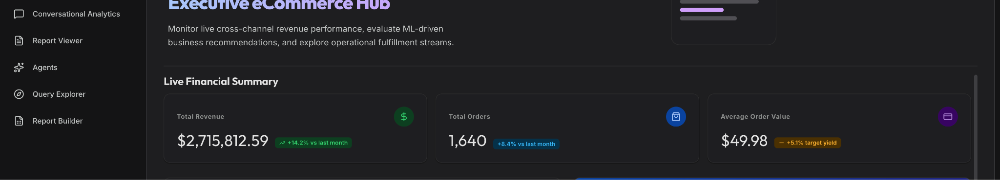
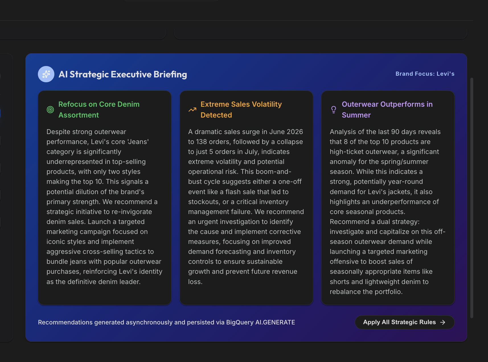
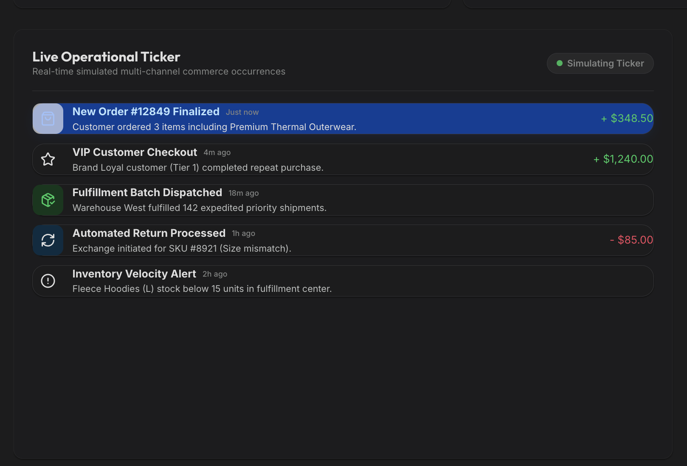

# Home & AI Executive Briefing Demo Script & Guide

When an external user or internal partner lands on the portal's Home page (`/`), they experience Looker as an operating system for data rather than a traditional embedded iframe. This page showcases a custom, headless React application powered entirely by Looker APIs and database-integrated Generative AI.

Instead of embedding static reports, the landing page uses the Looker TypeScript SDK to fetch metrics on demand, render custom React KPI cards, and display a localized AI Executive Briefing generated by BigQuery ML and Gemini.

This guide walks through how to present the Home page and AI Insights feed during a live technical or customer demo.

---

## Global Page Controls & Dev Tools
* **User & Brand Switcher (Settings Dialog)**: Allows reps to toggle between brand accounts (Calvin Klein, Levi's, Columbia) and user tiers (Simple, Gemini, Advanced).
* **Locale & Currency Selector**: Changes the active language (English, Spanish, French, German, Japanese) and currency (USD, EUR, JPY). Toggling these attributes dynamically re-runs queries and triggers real-time currency conversion and AI translation.
* **Dev Tools / Source Highlighter**: A toggleable visual outline tool that color-codes frontend elements (Green for direct API calls, Blue for embedded iframes), proving to technical buyers that the metrics are fetched programmatically via REST APIs.

---

## Page Sections & Walkthrough

### Section 1: Live REST API Powered KPI Grid

The top metric grid displays core commercial performance: Total Revenue, Total Orders, and Average Order Value. Unlike static dashboard tiles, these cards are custom React components (`KpiCard`) that execute Looker SDK query calls (`run_query`) asynchronously on component mount.

| Metric / Component | Query ID / Endpoint | What It Shows | Why It Matters |
| --- | --- | --- | --- |
| Total Revenue | `KPI_TOTAL_REVENUE_QUERY_ID `(`YghSR43rKKcY...`) | Aggregated commercial sales revenue formatted dynamically (e.g., `$45.2M`). | Demonstrates how developers can build bespoke executive scorecards without embedding heavy iframes. |
| Total Orders | `KPI_TOTAL_ORDERS_QUERY_ID `(`SdvjNhGRHfph...`) | Total distinct order count across the platform formatted in thousands (e.g., `128.4K`). | Proves Looker API speed and responsiveness in a headless frontend architecture. |
| Average Order Value | `KPI_AVERAGE_ORDER_VALUE_QUERY_ID `(`HhGN8kYyvNzF...`) | Mean unit selling price per order (e.g., `$85.40`). | Highlights precision formatting and real-time metric consistency between API outputs and dashboards. |

#### Demo Script

*"When your users arrive on the landing page, notice that these top KPI cards aren't embedded Looker dashboards—they are native React cards built into our application.*

*"Using Looker's TypeScript SDK, our frontend makes lightweight API calls to Looker's semantic layer. If I toggle our Developer Source Highlighter, you can see green borders around these cards indicating live API endpoints. This proves you can deliver lightning-fast, custom executive scorecards while still enforcing Looker's centralized data definitions and row-level security."*

---

### Section 2: Strategic AI Executive Briefing (`InsightsPanel`)

The AI Executive Briefing panel represents the cutting edge of Looker's database-integrated AI capabilities. Rather than exporting sensitive data to an external LLM wrapper, this feature runs generative AI directly inside the data warehouse using BigQuery ML and Google's Gemini models.

| Feature / Component | LookML / Backend Source | What It Shows | Why It Matters |
| --- | --- | --- | --- |
| In-Database Gemini Summary | LookML View: `ai_executive_briefing `Model: `gemini-2.5-pro` via BQML | A bulleted executive narrative summarizing brand sales performance, anomalies, and growth opportunities. | Eliminates data exfiltration risks and hallucination by grounding prompts in verified LookML metrics directly inside BigQuery. |
| Dynamic Localization & Currency | Looker User Attributes (`locale`, `currency`) | Automatic translation of AI narrative into Spanish, French, German, or Japanese, with dynamic currency conversion (USD to EUR, JPY). | Allows global enterprises to deliver tailored, native-language AI insights without maintaining separate international report pipelines. |

#### Demo Script

*"Below our KPIs is the Strategic AI Briefing. In an ordinary application, generating AI summaries means exporting sensitive database rows to an external LLM API, risking security breaches and hallucinations.*

*"Looker solves this with BigQuery ML. This insight feed calls a LookML view that executes Gemini 2.5 Pro directly inside Google Cloud's infrastructure. The AI is grounded in your verified LookML metrics. Watch what happens when I open Settings and switch our user locale from English to Japanese or Spanish: Looker re-runs the model inside the database, translating the strategic narrative and converting dollar amounts to Yen or Euros on the fly—all governed by user attributes."*

---

### Section 3: Operational Ticker (`SalesActivityFeed`)

The Operational Ticker streams recent order activity, providing a live pulse of customer transactions as they occur across the platform.

| Feature / Component | Looker SDK / API Method | What It Shows | Why It Matters |
| --- | --- | --- | --- |
| Live Transaction Stream | Looker SDK `run_inline_query `Explore: `order_items ` | A scrolling feed of recent individual customer orders, displaying item names, timestamps, and order values. | Bridges high-level analytical aggregates with granular, real-time operational execution for customer service and fulfillment teams. |

#### Demo Script

*"On the left side of our briefing, the Operational Ticker gives teams an immediate pulse on live commerce. By running lightweight inline queries through the Looker SDK, we stream recent transactions directly into the UI.*

*"This combination of high-level AI summaries on the right and granular operational streams on the left demonstrates how Looker powers both executive decision-making and day-to-day operational workflows on a single screen."*

---

## Technical Architecture & API Reference Table

| Component / Feature | Looker SDK / API Method | Architecture & Data Flow | Why It Matters |
| --- | --- | --- | --- |
| KPI Revenue Card | `sdk.run_query({ query_id: KPI_TOTAL_REVENUE_QUERY_ID, result_format: 'json' }) ` | React component fetches pre-defined Looker Query ID on mount and formats integer value. | Ensures single-source-of-truth KPI calculations without duplicate SQL logic in frontend code. |
| KPI Orders Card | `sdk.run_query({ query_id: KPI_TOTAL_ORDERS_QUERY_ID, result_format: 'json' }) ` | Asynchronous REST call retrieving total transaction count scoped to active user brand. | Demonstrates headless API speed and multi-tenant security enforcement. |
| KPI AOV Card | `sdk.run_query({ query_id: KPI_AVERAGE_ORDER_VALUE_QUERY_ID, result_format: 'json' }) ` | REST query call retrieving average order value formatted as currency. | Maintains financial rounding and calculation consistency across application layers. |
| AI Executive Briefing | `sdk.run_inline_query({ body: { model: 'embed_demo', view: 'ai_executive_briefing' } }) ` | Explores LookML view that invokes BQML `ML.GENERATE_TEXT` function with Gemini 2.5 Pro. | Delivers governed, in-database generative AI summaries without external API data exfiltration. |
| Operational Ticker | `sdk.run_inline_query({ body: { model: 'embed_demo', explore: 'order_items', limit: 10 } }) ` | Lightweight inline query fetching most recent order timestamps, products, and prices. | Streams operational activity directly into portal UI for immediate situational awareness. |

